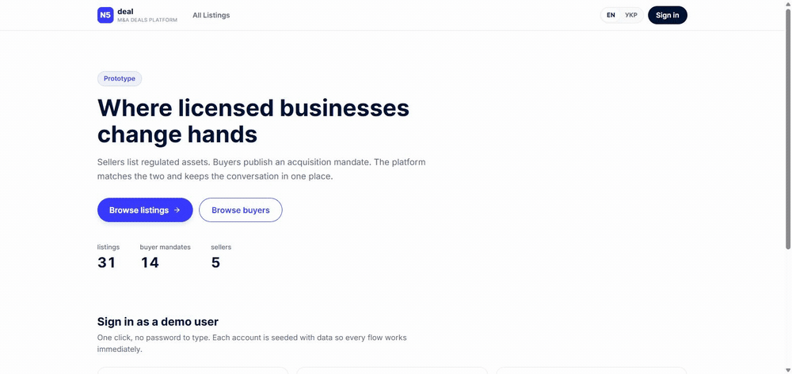

# N5Deal — marketplace prototype

A marketplace where regulated businesses and licences change hands. Sellers list
assets, buyers publish an acquisition mandate, a platform manager moderates both.

**Live:** https://n5deal-marketplace-beige.vercel.app
**Stack:** Next.js 15 (App Router) · TypeScript strict · Postgres + Prisma · Auth.js v5 · Tailwind 4 · next-intl · Gemini



One click into the buyer role, a mandate matched at 100% with the reasons that
produced the score, and a sentence — _"anything in Ireland or Malta under 4
million"_ — turned into real facets in the URL. Recorded against the deployed
build.

---

## Run it

Needs Node 20.11+ and a Postgres database. [Neon](https://neon.tech) is what this
was built against — free tier, no card.

```bash
git clone https://github.com/LeonidShamarin/n5deal-marketplace.git
cd n5deal-marketplace
npm install

cp .env.example .env        # then fill in DATABASE_URL, DIRECT_URL and AUTH_SECRET
npx prisma migrate deploy   # or `npm run db:migrate` for a dev database
npm run db:seed

npm run dev                 # http://localhost:3000
```

`AUTH_SECRET` can be generated with:

```bash
node -e "console.log(require('crypto').randomBytes(32).toString('base64'))"
```

**The app runs fully without an AI key.** `GEMINI_API_KEY` is optional; every AI
feature has a deterministic path underneath it. See [AI](#ai-three-features-none-of-them-load-bearing).

Other commands: `npm test` · `npm run test:e2e` · `npm run typecheck` · `npm run build` · `npm run db:studio`

### Demo accounts

The home page has a one-click button for each role — no password to type.

| Role             | Email                 | Password   |
| ---------------- | --------------------- | ---------- |
| Seller           | `seller@n5deal.demo`  | `demo1234` |
| Buyer            | `buyer@n5deal.demo`   | `demo1234` |
| Platform manager | `manager@n5deal.demo` | `demo1234` |

A shared, published password is a review-environment choice, not a production
one. It exists so that anyone opening the deployed link is inside each role in a
second.

---

## The decision that shaped everything else

**Buyer and seller are symmetric.** A seller looks for buyers; a buyer looks for
assets. Read as two features, that is two catalogues, two filter engines, two
sets of components. Read as one, it is a single engine with two card types.

So an `Asset` and a `BuyerProfile` are written in the **same attribute
vocabulary** — sector, licence type, ISO jurisdiction, ticket size — defined once
in [`src/lib/vocabulary.ts`](src/lib/vocabulary.ts). An asset says _"I am an EMI
in Lithuania at EUR 2M"_; a mandate says _"I want an EMI in Lithuania around EUR
1–6M"_. Three things fall out of that for free:

- one filtering engine ([`src/lib/filters.ts`](src/lib/filters.ts)) serves both catalogues;
- the facet UI, the search box and the pagination are the same components;
- **matching becomes a comparison of like with like**, so the scoring function is
  twenty lines of arithmetic rather than a heuristic.

Adding a new licence type means editing one file. Every label map is typed as
`Record<Enum, string>`, so extending a Prisma enum without adding its label is a
compile error, not an `undefined` in production.

---

## Architecture

### State lives in the URL

Every filter, the search term, the sort order and the page number are read from
`searchParams` and written back to the URL. Nothing about a result list lives in
React state. One decision, three requirements:

- **"state persists after refresh"** — reloading re-reads the URL. It is server
  state, not a `localStorage` trick;
- a filtered view is a **shareable link**, and the back button steps through
  filter changes the way a person expects;
- filtering runs **in Postgres**, not in the browser over an over-fetched list.

The language switch preserves the query string for the same reason — switching to
Ukrainian keeps your filters instead of resetting the page.

The parser is deliberately forgiving in one direction and strict in the other. A
hand-edited `?category=paymnets` drops the unknown value and renders the rest; a
reversed price range is swapped rather than returning nothing; `?page=1e9` clamps
to a ceiling so Postgres never sees an absurd offset. Nothing outside the
vocabulary ever reaches a query.

### Authorisation is server-side, and it is not the buttons

Hiding a control is presentation. [`src/lib/session.ts`](src/lib/session.ts) is
enforcement: every page and every server action that touches non-public data
starts there, so typing a URL by hand gets the same answer as clicking.

Pages use `forbidden()` / `unauthorized()` from Next's auth-interrupts API, which
return **real HTTP status codes** rather than a redirect that pretends the page
never existed. Measured while signed in as a buyer:

| Request                       | Status  |
| ----------------------------- | ------- |
| `/en/moderation/participants` | **403** |
| `/en/dashboard/listings/new`  | **403** |
| `/en/assets/999999`           | **404** |
| `/en/inbox` (their own)       | **200** |

Server actions cannot interrupt navigation, so they get the parallel path:
`withAction()` turns a guard failure into a typed result the form renders inline,
and re-throws Next's own control-flow errors untouched instead of swallowing them.

The JWT is trusted for identity only. Role and account status are re-read from
the database on every protected request, because a manager can suspend someone
who is already signed in and a token cannot be revoked. A suspended participant
is locked out on their **next request**, not their next sign-in.

Ownership is always re-read too. Editing the hidden `assetId` in a form gets a
403-equivalent failure, not someone else's listing.

### Nothing is deleted

Participants and listings carry lifecycle statuses. "Remove or suspend" from the
brief is a question about lifecycle, and answering it with `DELETE` would throw
away the ability to reverse a mistake, the conversations attached to the row, and
any chance of an audit trail.

```
User.status    ACTIVE → SUSPENDED (reversible) → REMOVED (terminal)
Asset.status   DRAFT · PUBLISHED · SUSPENDED · SOLD · ARCHIVED
```

**Suspending a seller does not touch their listings at all.** The public
catalogue hides them by joining on seller status:

```ts
const PUBLIC_ASSET_WHERE = { status: "PUBLISHED", seller: { status: "ACTIVE" } };
```

That is why unsuspending restores the _exact_ prior state rather than a guess.
Verified against the database rather than asserted — unsuspending the seeded
suspended seller:

|                  | before                   | after                        |
| ---------------- | ------------------------ | ---------------------------- |
| Seller status    | `SUSPENDED`              | `ACTIVE`                     |
| Their listings   | 1 `DRAFT`, 2 `PUBLISHED` | **1 `DRAFT`, 2 `PUBLISHED`** |
| Public catalogue | 31                       | **33**                       |

The draft stayed a draft. Suspending a _single listing_ does mutate the row, so
it records `previousStatus` first and restores it on unsuspend — falling back to
`DRAFT`, never `PUBLISHED`, when nothing was recorded, because an accidental
republish is worse than an accidental unpublish.

Every moderation action requires a reason of at least ten characters and writes a
`ModerationEvent` in the **same transaction** as the status change: an audit log
with holes in it is worse than none. Removal asks for a second explicit
confirmation, because it is the one action here that cannot be undone.

### Money

Integer minor units plus a currency enum. No floats anywhere near a price.

The column is `BigInt`, and that was a correction: `Int` is Postgres `INT4`, which
tops out at 2.1 billion minor units — **EUR 21.47M** — and a banking licence
clears that without effort. The seed failed on exactly that, which is the useful
kind of failure. Storing major units instead would have kept `Int`, at the cost of
the exactness that made minor units the choice in the first place.

### Thread deduplication

Contacting the same seller about the same listing twice must reopen the existing
conversation. The obvious `@@unique([assetId, buyerId, sellerId])` does not do it:
Postgres treats NULLs as distinct, so two "general" threads between the same pair
would both be allowed. Threads carry one non-null `key` instead —
`"<assetId|general>:<buyerId>:<sellerId>"` — and the write is an `upsert`, so two
racing clicks cannot produce two rows.

---

## AI: three features, none of them load-bearing

The same shape in all three: **rules decide, the model advises.** Each feature
works with no API key, and the UI says which layer answered rather than leaving
you to guess.

| Feature                 | Deterministic layer                                                                                                  | What the model adds                                               |
| ----------------------- | -------------------------------------------------------------------------------------------------------------------- | ----------------------------------------------------------------- |
| Natural-language search | [`nl-query.ts`](src/lib/nl-query.ts) parses sectors, jurisdictions, licence types and price bounds out of a sentence | Broadens what rules cannot know — _"the Baltics"_ → LT, LV, EE    |
| Listing review          | [`listing-review.ts`](src/lib/listing-review.ts) finds checkable contradictions                                      | Up to three suggestions, always hints, never a veto on publishing |
| Buyer ↔ asset matching  | [`matching.ts`](src/lib/matching.ts) scores five weighted factors                                                    | Turns the factors into a sentence                                 |

Three rules are enforced in [`src/server/ai/gemini.ts`](src/server/ai/gemini.ts)
rather than at each call site:

1. **The key is optional.** No key, no crash — a deterministic path runs instead.
2. **The model proposes, zod disposes.** One zod schema produces the JSON schema
   sent to the model _and_ validates what comes back, so an invented country code
   is dropped before it reaches a query.
3. **It is bounded.** One attempt, an 8-second `AbortSignal.timeout`, no retry
   loop. A slow model degrades a feature; it never hangs a page.

### Model choice, measured

Same prompt, two runs each:

| Model                       | Latency         | Result                                |
| --------------------------- | --------------- | ------------------------------------- |
| **`gemini-3.1-flash-lite`** | **0.7s / 1.4s** | correct — **chosen**                  |
| `gemini-3-flash-preview`    | 2.0s / 2.1s     | correct, but a preview name           |
| `gemini-flash-lite-latest`  | 1.7s / 2.7s     | wrapped the object in an array        |
| `gemini-3.6-flash`          | 22.4s / 27.3s   | correct, and unusable in a search box |

All four extracted identical filters, including expanding _"the Baltics"_ to
LT/LV/EE, so the decision came down to latency. `thinkingLevel: "LOW"` did not
help 3.6-flash (22.9s) and `thinkingBudget: 0` is rejected by it outright. Pinned
to an exact version rather than the floating `-latest` alias, so a model rotation
cannot change this app's behaviour after submission.

(`gemini-2.5-flash` was the first choice and is refused for recently created API
keys — the API answers 404, _"no longer available to new users"_.)

### What the model actually contributed

Reviewing a deliberately broken draft — an EMI licence in Singapore, operating
business, zero staff — the rules produced the error and the warnings. The model
added something the rules could not encode:

> Specify the exact MAS (Monetary Authority of Singapore) licence type held, as
> Singapore does not use the term 'EMI' but rather 'Major Payment Institution' or
> 'Standard Payment Institution'.

That is the division of labour the design is aiming for.

---

## Edge cases

Each of these was walked in the browser, not reasoned about:

- Suspending a seller hides their listings; unsuspending restores every status untouched (31 → 33 → 31).
- A removed seller's listing renders a **"withdrawn with its owner"** page — not a 404 that denies it existed, and not a 500 from a half-loaded relation.
- Contacting the same seller twice about the same listing lands in the **same thread**, both messages in order.
- A suspended or removed participant cannot be messaged, and a read-only banner replaces the composer in existing threads.
- Managers cannot moderate themselves or each other; sellers cannot edit a listing a manager has suspended.
- A hidden buyer mandate is **not found** for anyone not entitled to it, including someone who types the id — visibility is inside the query, not applied afterwards.
- Signed-out visitors get no buyer directory at all: who is buying what, with what budget, is not public.
- Every list has an empty state with a way out of it.

---

## Testing

`npm test` — **65 unit tests**, no database required, ~1.4s.
`npm run test:e2e` — **7 end-to-end scenarios** in Playwright, ~1.6 minutes.

They cover the pure functions where being wrong is expensive and invisible: money
parsing across the separators people actually paste, URL filter parsing as a trust
boundary, the matching score, the deterministic NL parser, the listing review
rules, and the thread key.

Three failed on the first run, and all three were worth having:

- **A real bug.** _"is **it** an operating business"_ selected Italy. Bare
  two-letter codes were matched case-insensitively, and IT, AT, BE, IN, IS and US
  are ordinary English words. Codes are now accepted only in capitals; country
  names stay case-insensitive.
- **Dead code.** The future-date rule in the listing reviewer was unreachable —
  the schema rejects the year first, and the reviewer only ever runs on
  schema-parsed input. Removed, rather than left as a safeguard that cannot fire.
- **A wrong expectation.** `?page=1e9` clamps to the page ceiling rather than
  falling back to page one. The test was wrong, not the code.

The runner is bounded on purpose — two workers, 5s per test, a heap cap on the
run — so a runaway test fails instead of taking the editor down with it.

### End to end

`npm run test:e2e` runs seven scenarios in Playwright — one main path per role,
plus the edge cases that a screenshot review would never catch.

First-time setup:

```bash
cp .env.test.example .env.test   # point it at a DIFFERENT database from .env
npm run db:create:test           # creates n5deal_test in the same Neon project
npm run db:migrate:test
npx playwright install chromium
npm run test:e2e
```

Two decisions shape the suite:

- **It has its own database.** The manager scenario suspends a seller and moves
  listing statuses around. Pointed at the database behind the deployed demo, it
  would leave a reviewer looking at a suspended participant and half a catalogue.
  `.env.test` targets a separate database and `globalSetup` re-seeds it before
  every run, so each run starts from a known state and a failed run cannot poison
  the next. Isolation was verified rather than assumed: after a full run the demo
  database still showed 42 assets, zero test listings and zero test audit rows.
- **It runs against a production build**, not `next dev`. The two differ in
  rendering and error handling, and this project already produced one finding
  that only appeared in the built output.

The suite also runs with **no `GEMINI_API_KEY`**, on purpose. Every AI feature
has a deterministic path underneath it, and these tests exercise that path — so
a green run is also proof the app works with no model available.

What the scenarios actually assert:

| Role    | Scenario                                                                                                                                |
| ------- | --------------------------------------------------------------------------------------------------------------------------------------- |
| Buyer   | Signs in, sees matched listings **with the reasons the scorer produced**, opens one, contacts the seller, finds the thread in the inbox |
| Buyer   | Contacting the same listing twice lands in the **same thread**, not a duplicate                                                         |
| Seller  | Creates a draft, confirms it is **absent from the public catalogue**, publishes it, finds it there                                      |
| Seller  | Another seller's edit URL answers **403**                                                                                               |
| Manager | Suspends a seller → catalogue shrinks → unsuspends → **the count returns exactly**, and both actions are in the audit log               |
| Manager | A suspended participant is refused at sign-in                                                                                           |
| Manager | Moderation answers **403** to a buyer                                                                                                   |

The manager cascade test is the one worth reading. It counts the public
catalogue as a visitor before, during and after, and asserts the number comes
back to precisely what it was — which only holds because suspension never writes
to the listings.

---

## Assumptions

Things the brief left open, decided rather than deferred:

- **"Contact" means an on-platform conversation**, not an email integration. Deals here start with questions under NDA; routing that through email would put the platform outside its own transaction.
- **Verification is a platform-issued badge, not a KYC flow.** Sellers carry a `verified` flag a manager sets. Real onboarding is a project, not a feature.
- **Deal mechanics are out of scope** — no escrow, no commission, no offer/counter-offer. The prototype takes two parties to the point of talking.
- **A buyer sees only their own mandate** in the buyer catalogue. Making it a competitor list would be a different product.
- **Managers moderate; they do not trade.** They hold no mandate and appear in no thread.
- **One mandate per buyer.** Multiple concurrent mandates are a real thing in this market and a schema change away, but they complicate matching without demonstrating anything new.
- **Prices are per-listing currency with no conversion.** A EUR filter compares against a USD listing numerically. Honest FX needs a rate source and a policy on which rate.

---

## Scope lines I drew deliberately

- **Next.js 15.5, not 16.** Next 16 was out during the build; Auth.js v5, next-intl and Prisma have been shipping against 15.x for months, and a 24-hour build is the wrong place to discover ecosystem gaps.
- **The domain taxonomy stays English in both locales.** The interface is fully translated — navigation, forms, facets, empty states, plurals, number and currency formatting. Sector and licence names are not, because that is how this market names them in Ukrainian writing too: EMI, VASP, MSO, Fintech. Translating them is a `Record<Locale, Record<Enum, string>>` away if that call is wrong.
- **Jurisdictions render as ISO codes, not flags.** Flag emoji were the first attempt and had to go: Windows ships no glyphs for the regional-indicator block, so Chrome there renders a flag as bare letters — broken-looking on the exact machine a reviewer is likely to use. The alternatives were an image CDN (an external dependency for decoration) or ~30 bundled SVGs.
- **Search is `ILIKE`, not full-text.** It runs in the database and it is honest about what it does. `pg_trgm` is the next step, not a rewrite.
- **Matching scores in memory** over a capped candidate set. The score has partial credit near the edges; expressing that as SQL would either flatten it into a crude boolean filter or become unmaintainable. At tens of listings the honest version is also the fast one.

---

## AI tools used

Built with **Claude Code** (Opus) as a pair, working from a written plan I made
first: architecture, data model, scope cuts and the order of work were decided
before any code, and the plan is what the commits follow.

Concretely, that meant: I chose the symmetric buyer/asset model, the URL-as-state
rule, the soft-delete lifecycle and the "rules decide, model advises" split;
Claude wrote most of the implementation against those decisions, and I verified
each flow in the browser as it landed. Several of the fixes recorded in the commit
history — the `INT4` overflow, the Windows flag rendering, the "Baltics" residual
emptying its own result set, the case-insensitive country codes — came out of that
verification rather than out of review.

**Gemini** (`gemini-3.1-flash-lite`) is the model the product itself calls, chosen
by the measurement above.

---

## What I would do next

In the order I would actually do it:

1. **Full-text search** on `pg_trgm` or Meilisearch, with the facet counts moving to a single aggregate query instead of one per page load.
2. **Notifications.** A message arrives and nobody knows. An outbox table plus a worker, not an inline email call.
3. **Optimistic updates** on the moderation and status controls — every action currently waits for a round trip.
4. **A policy-based permission layer.** The guards are explicit and readable, but they are `if` statements; at ten more roles-and-resources combinations they want to be data.
5. **Multiple mandates per buyer**, and saved searches with alerts — the natural next thing a real buyer asks for.
6. **Rate limiting on the AI endpoints.** They are behind a session guard and bounded per call, but nothing stops a signed-in user calling them in a loop.

---

## Known limitations

Stated rather than hidden:

- **A removed seller's listing returns HTTP 200** with an explanatory page. The App Router has no supported way to set an arbitrary status code from a page; 401 and 403 use the auth-interrupts primitives, and a literal 410 would need the page to move behind a route handler.
- **`npm audit` reports high-severity advisories** in transitive build-time dependencies (`postcss`, `sharp`, `deepmerge-ts`). None are reachable from application runtime code, and `audit fix --force` would downgrade major versions of Next and Prisma.
- **Page metadata is not localised** — `<title>` is English on Ukrainian pages.
- **The moderation lists cap at 25 rows** with no pagination. The catalogues paginate properly; the moderation views were scoped to the seeded data.
- **View counts increment per render**, so a refresh counts. Deduplicating needs a viewer fingerprint and a window.
